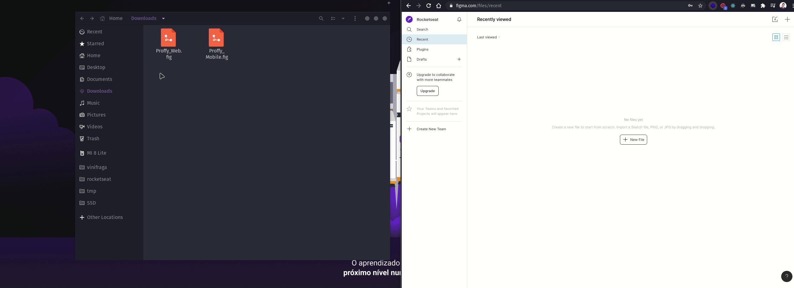
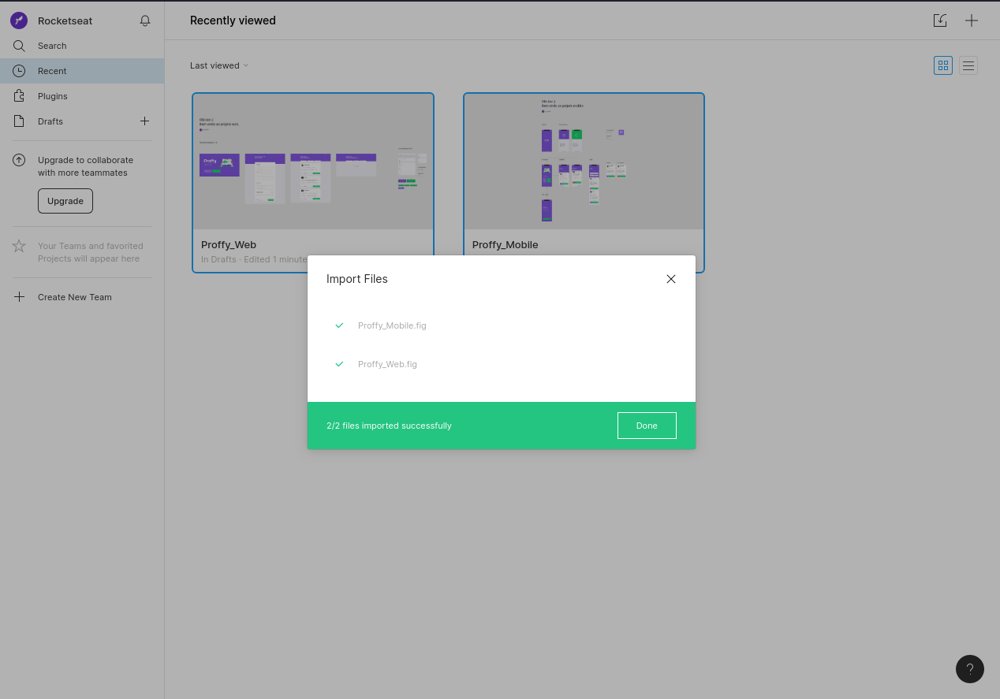

[Layout Proffy](https://www.notion.so/Layout-Proffy-3d5f45f54ec54ef9b2103565b7cce4e1)

# Acessando o Layout

Há três opções para acessar o layout da aplicação desta edição do NLW. Confira aqui:

## Opção 1 - Download dos arquivos `.fig`

Para seguir por essa opção, primeiro você deve criar uma conta gratuita no Figma, para isso, você pode [clicar aqui](https://www.figma.com/signup). Na página de cadastro, você pode logar diretamente com sua conta do Google ou criar uma conta com o e-mail que você preferir.

Após criar sua conta, você pode acessar sua Dashboard do Figma, para isso basta acessar [https://www.figma.com/](https://www.figma.com/) e ele vai te redirecionar para a Dashboard.

Caso ele não redirecione diretamente para a sua dashboard, existe um botão "Log in" no canto superior direito da tela, que permitirá você acessar a conta que você acabou de criar e, ao logar, você será redirecionado automaticamente.

Agora dentro da sua Dashboard, basta baixar e arrastar os arquivos com formato `.fig` que nós disponibilizamos logo abaixo para a tela do seu navegador e pronto!

[Proffy_Web.fig](arquivos/Proffy_Web.fig)

[Proffy_Mobile.fig](arquivos/Proffy_Mobile.fig)

Agora é só aguardar os arquivos serem enviados e você poderá acessá-los diretamente no Figma.

## Opção 2 - Duplicando o layout do figma

Para seguir por essa opção, você também deve ter uma conta no Figma, para isso, você pode [clicar aqui](https://www.figma.com/signup). Na página de cadastro, você pode logar diretamente com sua conta do Google ou criar uma conta com o e-mail que você preferir.

Após criar sua conta, você pode acessar sua Dashboard do Figma. Para isso basta acessar [https://www.figma.com/](https://www.figma.com/) e ele vai te redirecionar para a Dashboard.

Caso ele não redirecione diretamente para a sua dashboard, existe um botão "Log in" no canto superior direito da tela, que permitirá você acessar a conta que você acabou de criar e, ao logar, você será redirecionado automaticamente.

Agora para duplicar os layouts, basta você clicar nos links abaixo. Ele adicionará o Layout à sua dashboard do Figma automaticamente, como uma cópia.

[Clique aqui para duplicar o layout Web](https://www.figma.com/file/GHGS126t7WYjnPZdRKChJF/Proffy-Web/duplicate)

[Clique aqui para duplicar o layout Mobile](https://www.figma.com/file/e33KvgUpFdunXxJjHnK7CG/Proffy-Mobile/duplicate)

## Opção 3 - Visualizando diretamente o layout

Nessa opção você não precisa ter uma conta no Figma e poderá visualizar o layout diretamente pelo navegador, mas ela é limitada a 50 acessos simultâneos. Após os 50 acessos simultâneos, só é permitido acessá-lo em modo de "Apenas visualizar" o layout, e nada mais.

Caso você queira ter um acesso avançado ao Layout, com todas as medidas e opções (ex.: copiar o texto diretamente do Figma), recomendamos seguir uma das duas opções acima.

[Clique aqui para acessar o layout Web](https://www.figma.com/file/GHGS126t7WYjnPZdRKChJF/Proffy-Web)

[Clique aqui para acessar o layout Mobile](https://www.figma.com/file/e33KvgUpFdunXxJjHnK7CG/Proffy-Mobile)
